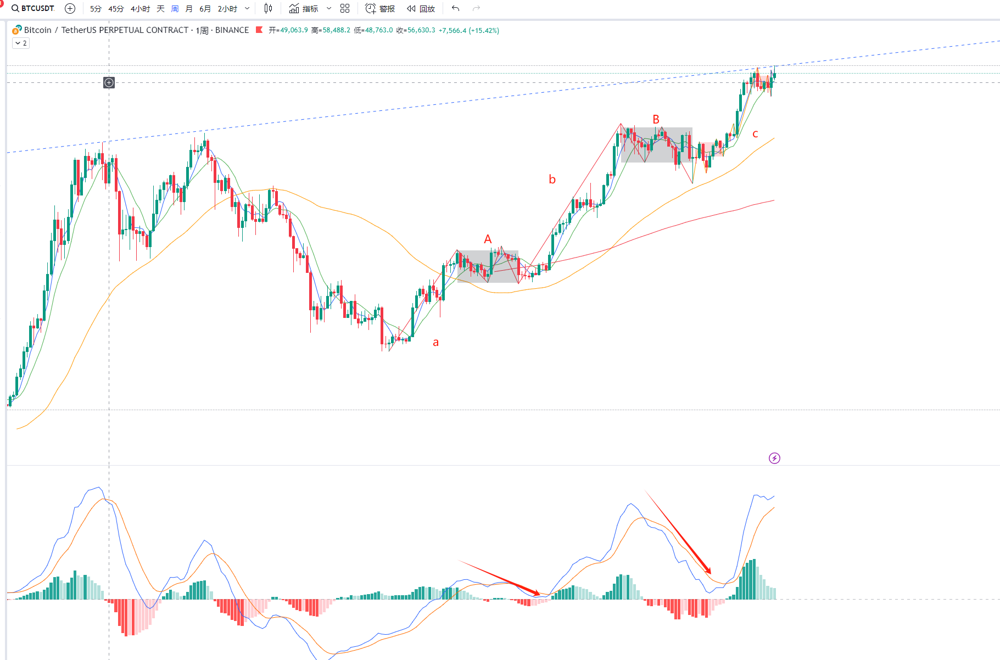
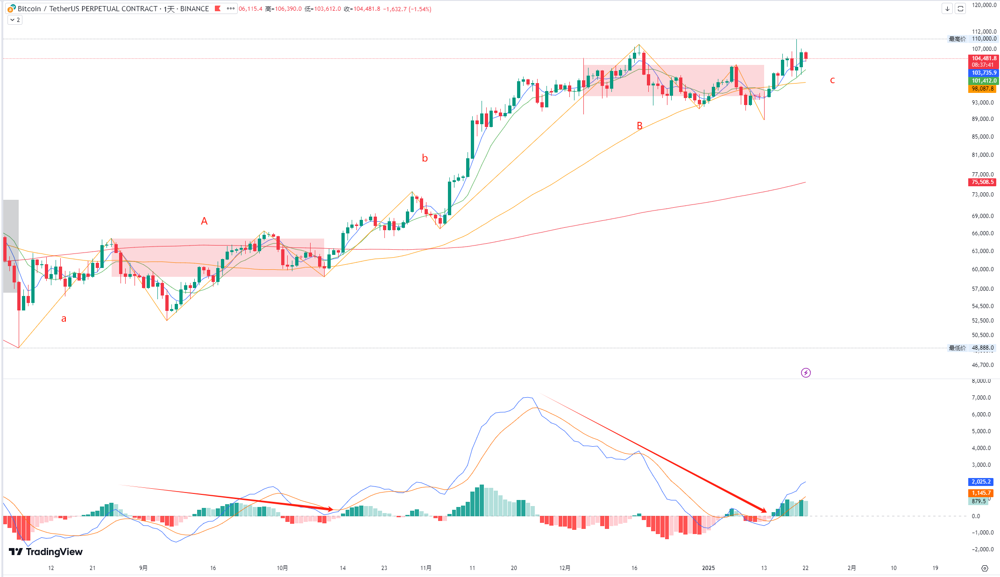
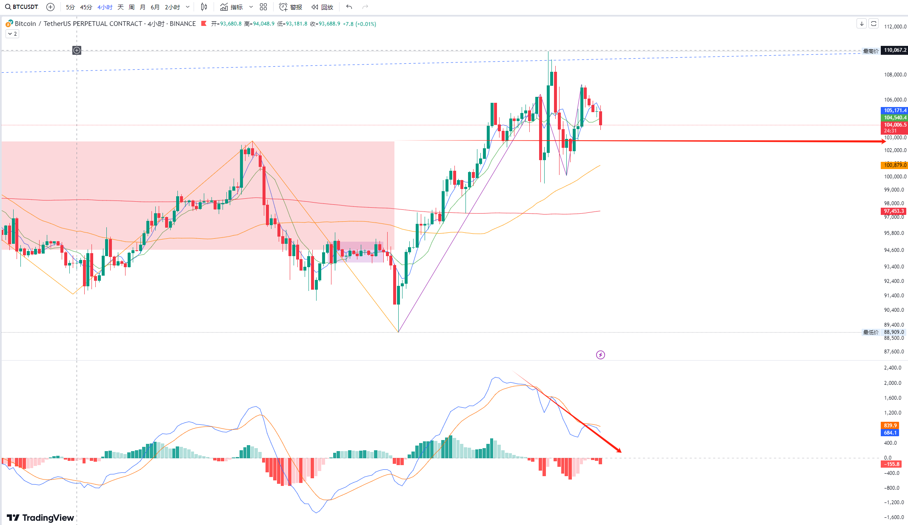

## 1. 当前BTCUSDT在周级别上面临的风险

从2023年1月开始，BTC两年的经历的两年了上涨，形成了a+A+b+B+c的形态， 虽然力度上 c > b , 但是一旦c结束掉， c回到中枢B的概率很大。

很巧合的是， 这个位置在对数坐标图上，正好是20-21年牛市两个高点连线的压力位

## 2. 日级别上， c面临着标准背驰结束掉的可能

日线上，近半年的走势， 同样走出了两中枢结构， 不同的是，当前力度上  c < b 。

## 3. 4h级别上，考察周级别c中 日级别的走势， 关注其什么时候结束 

4h走势暂无结束的感觉，   如果能在103000上得到支撑。 再破新高，  将构成多有多义性3买的离开段， 这样就可以完美的去结束日线上的趋势， 形成趋势背驰。 这将是绝好的做空机会。

## 4.耐心观察，等待机会

等待日线上c的完成，  一旦有完成迹象， 就有可能扭转大饼的牛市。